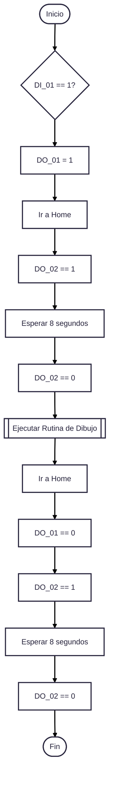

# Robótica 2025-I Laboratorio-No.02
***Robótica Industrial - "Trayectorias, Entradas y Salidas Digitales"***  
  
Maria Lucia Arias Ortiz - `mariasor@unal.edu.co`  
Andrés Felipe Quenan Pozo - `aquenan@unal.edu.co`
***
# Video
A continuación se presenta el video del desarrollo de este laboratorio. 

# Introducción
Este repositorio documenta el desarrollo del Laboratorio No. 02 de Robótica Industrial, enfocado en el manejo avanzado de trayectorias, así como el uso de entradas y salidas digitales en un robot ABB IRB 140. El objetivo principal fue programar el robot para ejecutar una tarea de dibujo precisa sobre una superficie, simulando la personalización de un "pastel". Para lograrlo, se diseñó e imprimió una herramienta personalizada y se emplearon diversas funcionalidades del software RobotStudio y del lenguaje RAPID, incluyendo la calibración de herramientas y workobjects, y la integración con la banda transportadora y señales digitales. Este informe detalla el proceso completo, desde el diseño conceptual hasta la implementación práctica.

# Objetivos

* Conocer los elementos de un robot industrial.
* Realizar calibración de herramientas en el robot real, así como en RobotStudio.
* Identificar los tipos de movimientos en el espacio de la herramienta útiles para trabajos de manipulación.
* Ampliar el manejo de funciones proporcionadas por RobotStudio.
* Utilizar diversas funciones de RAPID.
* Utilizar el módulo de entradas y salidas digitales dispuesto en el controlador IRC5.

# Descripción de la solución planteada

El robot ABB IRB 140 fue programado para dibujar los nombres de los integrantes del grupo y un gato sobre un pastel (una caja con superficie de 23 cm x 15 cm) ubicado en una banda transportadora. Para ello, primero se diseñó e imprimió en 3D una herramienta personalizada en Inventor, adaptada a las dimensiones del marcador y del flange del robot. Posteriormente, en RobotStudio, se cargó esta herramienta para simular el proceso: se calibraron el workobject y la herramienta, se añadió la banda transportadora y se desarrolló el código en RAPID que definía las trayectorias y orientaciones, junto con las entradas y salidas digitales para iniciar la rutina y mover la banda. Una vez verificado el funcionamiento en la simulación, se implementó el programa en el robot real, donde se recalibraron la herramienta y el workobject manualmente, y se cargó el módulo de código al controlador para ejecutar los dibujos.

# Diseño de la herramienta 
Se diseñó en Inventor una herramienta modular con ángulo ajustable que permitía seleccionar el ángulo óptimo para el proceso de dibujo; este ángulo se adaptó finalmente a 30° en la práctica. El diseño se compone de tres partes principales: la base, que se atornilla al flange del robot; el portaherramientas, encargado de sujetar el marcador y el resorte; y la tapa, que asegura que ni el resorte ni el marcador se salgan durante el proceso. Para el diseño, se tuvieron en cuenta las dimensiones del marcador, los agujeros del flange del robot y las tolerancias dimensionales, garantizando así que el marcador encajara correctamente y que la herramienta pudiera atornillarse al robot. Se agregó un resorte para permitir una presión constante y uniforme del marcador sobre la superficie, asegurando trazos consistentes sin importar pequeñas variaciones en la altura del "pastel" o el desgaste de la punta. Este modelo fue impreso en PLA utilizando una impresora 3D.

# Plano de planta de la ubicación de cada uno de los elementos
Se presenta el plano de planta con los elementos y su respectiva ubicación en el entorno de RobotStudio.

# Diagrama de flujo de acciones del robot
A continuación se muestra el diagrama de flujo de acciones del robot para realizar el dibujo propuesto. 

# Descripción de las funciones utilizadas
Para poder desarrollar el código que le permite al robot dibujar el diseño planteado se utilizaron las siguientes funciones:
* **MoveL:** Mueve el TCP del robot en una trayectoria recta desde la posición actual hasta un punto de destino específico. La orientación de la herramienta se mantiene constante o cambia linealmente durante el movimiento, dependiendo de cómo se defina el punto de destino. Es ideal para tareas que requieren precisión en la trayectoria. 
* **MoveJ:** Mueve cada una de sus articulaciones individualmente desde su posición actual hasta alcanzar la configuración articular del punto de destino. Esto significa que la trayectoria del TCP no es necesariamente una línea recta, ya que el robot busca la ruta más rápida y eficiente en el espacio articular, resultando a veces en una trayectoria curva en el espacio cartesiano. Es la instrucción más rápida y se usa comúnmente para movimientos punto a punto donde la trayectoria no es crítica.
* **MoveC:** Mueve el TCP a lo largo de un arco circular. Requiere dos puntos de destino: un punto intermedio por el que pasará el arco y el punto final del arco. La trayectoria es siempre una porción de un círculo. 

# Código en RAPID del módulo
Se presenta el módulo utilizado para el desarrollo de la práctica se encuentra implementado en RAPID

# Resultados
En esta sección se muestra el dibujo diseñado para ser realizado por el robot y el resultado final.

## Diseño planteado

## Dibujo realizado por el robot

# Conclusiones
* Este laboratorio demostró exitosamente la capacidad del robot ABB IRB 140 para ejecutar tareas de alta precisión mediante la programación de trayectorias complejas y el uso estratégico de entradas y salidas digitales.
* La fase de diseño y la posterior impresión 3D de la herramienta resultaron cruciales para la adaptación del robot a la tarea específica de dibujo, permitiendo un control óptimo sobre la presión del marcador y la consistencia de los trazos.
* La simulación en RobotStudio fue fundamental para validar la lógica del programa y prever posibles conflictos antes de la implementación en el robot real, lo que optimizó el tiempo de desarrollo y minimizó errores.
* La experiencia reafirmó la importancia de la calibración precisa de herramientas y workobjects, así como el dominio de funciones RAPID (MoveL, MoveJ, MoveC) para lograr movimientos fluidos y adaptados a cada fase del dibujo.
